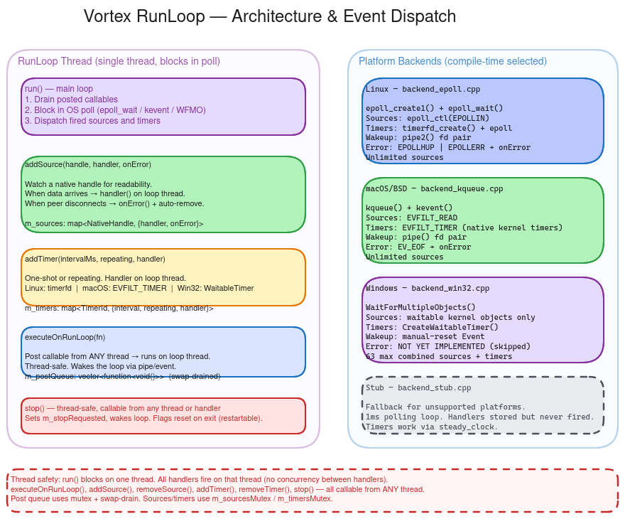
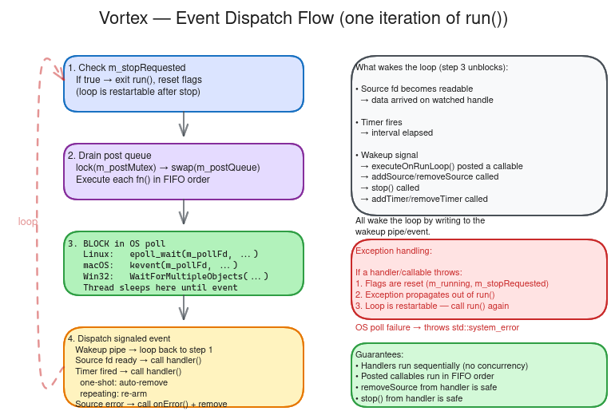

# Vortex

[](https://github.com/Mrunmoy/Vortex/actions/workflows/ci.yml)
[](https://mrunmoy.github.io/Vortex/)
[](LICENSE)
[]()

**Cross-platform event loop for C++17**



Vortex provides a single-threaded event loop with native OS backend support. It dispatches file descriptor readability events, timers, and arbitrary callables posted from any thread. The C++17 API lives in `namespace vortex`; a stable C API (`vortex.h`) is available for FFI consumers.

## Quick Start

```cpp
#include "RunLoop.h"
#include <cstdio>
#include <thread>

int main()
{
    vortex::RunLoop loop;
    loop.init("Example");

    std::thread t([&] { loop.run(); });

    loop.executeOnRunLoop([&] {
        std::printf("Hello from the run loop thread!\n");
        loop.stop();
    });

    t.join();
    return 0;
}
```

Build and run:

```bash
python3 build.py -e          # build library + examples
./build/example/basic_usage
```

## API

### C++ (`vortex::RunLoop`)

| Method | Description |
|--------|-------------|
| `init(name)` | Initialize the loop with a display name. Throws `std::logic_error` if already initialized. |
| `run()` | Block and dispatch events until `stop()` is called. Propagates handler exceptions. Restartable after return. |
| `stop()` | Signal the loop to exit `run()`. Thread-safe, callable from any thread or handler. |
| `executeOnRunLoop(fn)` | Post a callable for FIFO execution on the loop thread. Thread-safe. |
| `addSource(handle, handler)` | Watch a native handle for readability. Thread-safe. |
| `addSource(handle, handler, onError)` | Watch with an error/hangup callback. Source is auto-removed on error. |
| `removeSource(handle)` | Stop watching a handle. Thread-safe. |
| `addTimer(intervalMs, repeating, handler)` | Schedule a one-shot or repeating timer. Returns `TimerId`. Thread-safe. |
| `removeTimer(id)` | Cancel a timer. Thread-safe. |
| `isRunning()` | Returns `true` while `run()` is actively dispatching. |
| `name()` | Returns the display name passed to `init()`. |

Types: `NativeHandle` is `int` on Unix, `void*` on Win32. `TimerId` is `uint64_t`.

### C API (`vortex.h`)

| Function | Description |
|----------|-------------|
| `vortex_create` / `vortex_destroy` | Allocate and free a run loop instance. |
| `vortex_init` / `vortex_run` / `vortex_stop` | Lifecycle management. |
| `vortex_post` | Post a callback for execution on the loop thread. |
| `vortex_add_source` | Watch a file descriptor for readability. |
| `vortex_add_source_with_error` | Watch with error/hangup callback. |
| `vortex_remove_source` | Remove a watched descriptor. |
| `vortex_add_timer` / `vortex_remove_timer` | Timer management. |
| `vortex_is_running` / `vortex_name` | Query state. |
| `vortex_free` | Free strings returned by the library. |

## Platform Support

| Platform | Backend | Mechanism | Notes |
|----------|---------|-----------|-------|
| Linux | `backend_epoll.cpp` | `epoll` + `timerfd` | Preferred backend. |
| macOS | `backend_kqueue.cpp` | `kqueue` + `EVFILT_TIMER` | Native kernel event queue. |
| Windows | `backend_win32_iocp.cpp` | `IOCP` + `RegisterWaitForSingleObject` + threadpool timers | No handle limit. Fair dispatch. |
| Stub | `backend_stub.cpp` | Polling fallback | For porting to new platforms. |

## How It Works



The `run()` method enters a blocking wait on the platform's native multiplexer (epoll, kqueue, or IOCP). When an event fires — a descriptor becomes readable, a timer expires, or the internal wakeup mechanism is signalled — the loop dispatches the corresponding handler on its own thread. Posted callables are drained in FIFO order on each iteration of the dispatch cycle. Calling `stop()` signals the loop, causing `run()` to return after processing any remaining queued work.

All mutation methods (`addSource`, `removeSource`, `addTimer`, `removeTimer`, `executeOnRunLoop`) are thread-safe and can be called from any thread, including from within handlers.

## Installation

### As a CMake submodule

```cmake
add_subdirectory(deps/vortex)
target_link_libraries(your_target PRIVATE vortex::vortex)
```

### System-wide install

```bash
cmake -B build -DCMAKE_BUILD_TYPE=Release
cmake --build build -j$(nproc)
sudo cmake --install build
```

After installation, use `find_package(vortex)` in your project.

## Building from Source

```bash
python3 build.py              # Build library
python3 build.py -t           # Build + run tests
python3 build.py -c -t        # Clean rebuild + tests
python3 build.py -e           # Build + examples
```

Or using CMake directly:

```bash
cmake -B build -DCMAKE_BUILD_TYPE=Debug -DVORTEX_BUILD_EXAMPLES=ON
cmake --build build -j$(nproc)
ctest --test-dir build --output-on-failure
```

### Dependencies

| Dependency | Required | Notes |
|------------|----------|-------|
| C++17 compiler | Yes | GCC 7+, Clang 5+, MSVC 2017+ |
| CMake 3.16+ | Yes | Build system |
| Python 3.6+ | Optional | For `build.py` convenience script |
| Google Test | Optional | Fetched automatically for tests |

## Examples

| Example | Description |
|---------|-------------|
| [`basic_usage.cpp`](example/basic_usage.cpp) | Post tasks and stop the loop from a worker thread. |
| [`event_notifier.cpp`](example/event_notifier.cpp) | Watch file descriptors and react to I/O readability events. |

## Project Structure

```
inc/
  RunLoop.h                    C++ public header
  vortex.h                     C API public header
src/
  CApi.cpp                     C API wrapper
  backend_epoll.cpp            Linux (epoll + timerfd)
  backend_kqueue.cpp           macOS (kqueue)
  backend_win32_iocp.cpp       Windows (IOCP)
  backend_stub.cpp             Polling fallback
test/                          Google Test suite (86 tests)
example/                       Usage examples
doc/                           Architecture guide and diagrams
build.py                       Build convenience script
CMakeLists.txt
```

## Documentation

- [RunLoop Walkthrough](WalkthroughRunLoop.md) -- step-by-step guide to the dispatch loop internals
- [Architecture Guide](doc/architecture-guide.md) -- backend selection, threading model, platform constraints
- [C API Tests](test/) -- the C API test suite doubles as usage reference

Coverage dashboard: [mrunmoy.github.io/Vortex](https://mrunmoy.github.io/Vortex/)

## License

Vortex is released under the [MIT License](LICENSE).
